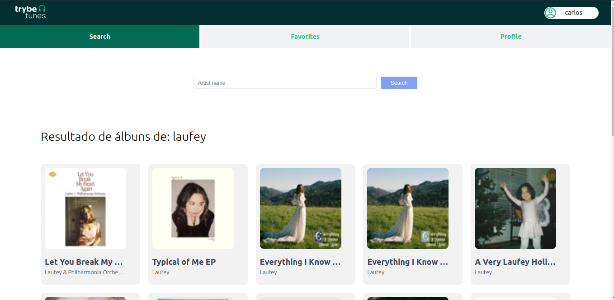

<p align="center">
  
</p>

## 📋 Sobre o projeto
Busque por álbuns de artistas, e ouça previews de suas músicas



## 💻 Tecnologias
- React
- React Router

## ✨ Funcionalidades 
- Buscar por álbuns de um artista
- Ouvir previews da músicas de um álbum
- Favoritar músicas
- Editar configurações de seu perfil

## 🧠 Aprendizado
Durante esse projeto aprendi a trabalhar com react router

## 📦 Inicialização
```bash
npm i
```
```bash 
npm start
```
